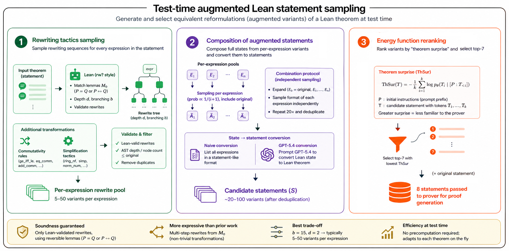

# What are the Right Symmetries for Formal Theorem Proving?

Implementation of rewriting ensembles for robust formal theorem proving, introduced in the paper _What are the Right Symmetries for Formal Theorem Proving?_.

[](https://arxiv.org/abs/2605.22257)
[](https://www.python.org/)

<p align="center">
  
</p>

## Overview

This repository provides code for applying rewriting-based test-time strategies to formal theorem proving.
The current pipeline supports:

- Generating proofs from configured prover/dataset setups
- Organizing multiple sampled attempts per problem
- Re-verifying generated attempts in Slurm array jobs

Repository: [github.com/kolejnyy/rw-ensembles](https://github.com/kolejnyy/rw-ensembles)

## Installation

Python `3.10` is required.

Create and activate an environment:

```bash
conda create -n rwens python=3.10
conda activate rwens
```

Install PyTorch for your CUDA/runtime setup.
The original experiments used `torch 2.9.1+cu128`:

```bash
pip install torch==2.9.1 torchvision==0.24.1 torchaudio==2.9.1 --index-url https://download.pytorch.org/whl/cu128
```

Install project dependencies:

```bash
pip install -r requirements.txt
pip install -e .
```

## Quickstart

From the repository root on a CUDA-enabled machine, run proof generation with a bundled config:

```bash
conda activate rwens
python scripts/src/eval/generate_solutions.py --config configs/testing/miniF2F/minif2f-valid-deepseek-noncot.yaml
```

## Running Proof Generation

The config YAML controls:

- prover model setup (`prover`)
- dataset and split (`dataset_path`, `split`)
- sampling settings (`num_attempts`, `batch_size`)
- output namespace (`experiment_id`)

With `configs/testing/miniF2F/minif2f-valid-deepseek-noncot.yaml`, outputs are written to:

`results/minif2f/valid/deepseek-miniF2F-valid-noncot/`

Each selected problem gets its own subdirectory containing `attempts.jsonl`.
You can adjust fields such as `limit` and `experiment_id` to change workload size and output location.

## Verifying Proofs on Slurm

After generation produces `attempts.jsonl` files, submit re-verification jobs:

```bash
bash scripts/run_verification.sh results/minif2f/valid/deepseek-miniF2F-valid-noncot
```

The wrapper script enters `REPO_ROOT` and runs
`scripts/src/testing_pipeline/submit_verification_array.py`.

Defaults:

- `REPO_ROOT=/slurm-storage/krzole/rw-ens`
- `RWENS_PYTHON=/slurm-storage/krzole/.conda/envs/rwens/bin/python`

To run on another host/layout:

```bash
export REPO_ROOT=/path/to/rw-ens
export RWENS_PYTHON=/path/to/conda/envs/rwens/bin/python
bash scripts/run_verification.sh results/minif2f/valid/deepseek-miniF2F-valid-noncot
```

Logs are typically stored under `.slurm/pipeline/<folder_name>/`.
Problems with existing re-verification outputs are skipped unless overridden (for example with `--no-skip-existing`).
Extra arguments after the solutions directory are forwarded to `submit_verification_array.py`.

Example with higher concurrency:

```bash
bash scripts/run_verification.sh results/minif2f/valid/deepseek-miniF2F-valid-noncot --max-concurrent 4
```

## Citation

If you use this codebase in research, please cite:

```bibtex
@article{olejniczak2026right,
  title={What are the Right Symmetries for Formal Theorem Proving?},
  author={Olejniczak, Krzysztof and Dimitrov, Radoslav and Huang, Xingyue and Grau, Bernardo Cuenca and Kim, Jinwoo and Ceylan, {\.I}smail {\.I}lkan},
  journal={arXiv preprint arXiv:2605.22257},
  year={2026}
}
```
